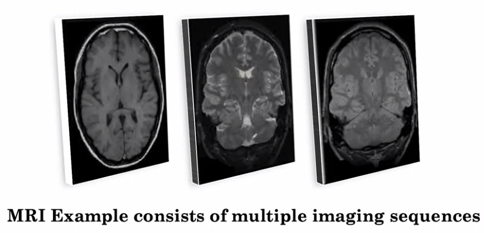

# AI for Medicine - Course 1: AI for Medical Diagnosis
## Week 3: Image Segmentation on MRI images

By the end of this week, you will prepare 3D MRI data, implement an appropriate loss function for image segmentation, and apply a pre-trained U-net model to segment tumor regions in 3D brain MRI images.

In particular, you will:
- Perform image segmentation on 3D MRI data.
- Take random sub-samples from a 3D image.
- Standardize an input image.
- Apply a pre-trained U-Net model.
- Implement a proper loss function for model training (soft dice loss).
- Evaluate model performance by calculating sensitivity and specificity.

### Explore MRI data
#### MRI Data and Image Registration
Magnetic resonance imaging (MRI) is an advanced imaging technique that is used to observe a variety of diseases and parts of the body.

At a high level, MRI works by measuring the radio waves emitting by atoms subjected to a magnetic field. 

The MRI scan is one of the most common image modalities that we encounter in the radiology field.
Other data modalities include:
- Computer Tomography (CT),
- Ultrasound
- X-Rays.

Compared to 2D image like X-rays, MRI sequence is a 3D volume.

The plane of this MRI is Coronal, not Axial.

The Main disadavantage of processing each MRI slice independently using a 2D segmentation model is
- You lose some context between slices. 

The key idea that we will use to combine the information from different sequences is to <b>treat them as different channels.</b>
- Idea: RGB color channel &rarr; Depth channel
- You can extend this idea to stacking more channels than just 3. (But there is a memory limit)
- Challenge: Misalignment problem due to patient moving between images.
- Preprocessing: Image Registration is the solution to the misalignment problem.

Note that, most of the 3D volume data in medical setting needs preprocessing step of <b>image registration</b>.

<image width="30%" src="Images/image_registration.jpg"/>

### Image Segmentation
#### Segmentation
What is Segmentation?
- The process of defining the boundaries of various tissues.
- The task of determining the class of every point(in 2D: pixel, in 3D: voxel).

Why 3D approach?
- 2D approach loses important <b>3D context</b>. 
- For instance, if there is a tumor in one slice, there is likely to be a tumor in the slices right adjacent to it.

Why not use whole sequence of MRI data?
- In the 3D approach, ideally, we'd want to pass in the whole MRI volume into the segmentation model and get out a 3D segmentation map for the whole MRI. However, the size of the MRI volume makes it impossible to pass it in all at once into the model. <b>It would simply take too much memory and computation.</b> 

## U-Net
The u-net is convolutional network architecture which consists of <b>a contracting path followed by an expanding path</b> for fast and precise segmentation of images. The U-Net was first designed for biomedical image segmentation and demonstrated great results on the task of cell tracking.

<image width="75%" src="Images/U-net_example.png"/>

The U-Net consists of two paths: a contracting path, and an expanding path. The contracting path is a typical convolutional network like used in image classification. It consists of repeated application of convolution and pooling operations. The convolution operation here is called a down convolution. The key here, is that in the contracting path, our feature maps gets spatially smaller, which is why it's called a contraction. Then, there is the expanding path. The expanding path in some ways is doing the opposite of the contracting path. It's taking our small feature maps through a series of up-sampling and up-convolution steps to get back to the original size of the image. It also concatenates the up-sample representations at each step with the corresponding feature maps at the contraction pathway. Finally, at the last step, the architecture outputs the probability of tumor for every pixel in the image. 

The U-Net architecture can be trained on input output pairs of 2D slices in the 2D approach. We've covered the U-Net for the 2D approach. Let's see what we can do when we have 3D subvolumes in the 3D approach. We can feed any 3D subvolume into a segmentation architecture, if we can replace all of the 2D operations with their 3D counterparts. This is exactly what an extension to the U-Net called the 3D U-Net does. The 2D convolutions become 3D convolutions, and the 2D pooling layers become 3D pooling layers. It's okay if you haven't seen 3D convolutions before. All that's important to understand here is that the 3D U-Net allows us to pass in 3D subvolumes and get an output for every voxel in the volume specifying the probability of tumor. The 3D U-Net can be trained on subvolume input and outputs as part of the 3D approach.

- blog post by [Heet Sankesara “UNet”](https://towardsdatascience.com/u-net-b229b32b4a71)
- [Original Paper](https://arxiv.org/pdf/1505.04597.pdf)
- [A brief video introduction to U-Net](https://lmb.informatik.uni-freiburg.de/people/ronneber/u-net/)

## Data Augmentation
Note that in segmentation, you have to apply same geometric transformation to input image and output of the segmentation mask.

<image width="75%" src="images/data_augmentation.jpg"/>

Note that, data augmentation should be applied with care so as not to change the data's label.

## Loss function for Segmentation : Soft Dice Loss
[Dice Loss](https://en.wikipedia.org/wiki/S%C3%B8rensen%E2%80%93Dice_coefficient) is a popular loss function for segmentation models.
- Works well in the presece of imbalanced data
- In our task of brain tumor segmentation, a very small fraction of the brain will be tumor regions.

The soft dice loss will measure the error between our prediction map, P, and our ground truth map, G.

<image width="50%" src="Images/soft_dice_loss.jpg"/>

### Practical Considerations
#### Different Populations and Diagnostic Technology
One of the main challenges with applying AI algorithms in the clinic, is achieving reliable generalisation.

Examples:
- Tuberculosis is quite prevalent in India, but unlikely to be as prevalent in the hospitals where we've trained our model in the US.
- Different Resolution of CT scanners
- MRI technology is not standard across the globe and across time. The latest scanners have much higher resolution than older scanners.
- Performance drops when an X-ray classification model is developed on data from US hospitals and is later tested on an external dataset from Latin America.

## External validation
To be able to measure the generalisation of a model on a population that it hasn't seen, we want to be able to evaluate on a test set from the new population.
- External validation: when the test set is drawn from the <b>different</b> distribution as the training set for the model.
- Internal validation: when the test set is drawn from the <b>same</b> distribution as the training set for the model.

And if we find that we're not generalising to the new population, then we could get a few more samples from the new population to create a small training and validation set and then fine-tune the model on this new data.
- Retrospective(Historical) Data: data which <b>already have</b> the disease/condition.
- Real-World / Prospective Data: A prospective study (sometimes called a prospective cohort study) is a type of cohort study, or group study, where participants are enrolled into the study <b>before</b> they develop the disease or outcome in question.

## Measuring Patient Outcomes
Another challenge for the real-world deployment of AI models is that we need metrics to reflect clinical application.

In the real world, we want to be able to look at the effect of our model on <b>real patients</b>.

Approaches:
- Decision curve analysis, which can help quantify the net benefit of using a model to guide patient care
- See what happens in the setting of a randomised control trial where we compare patient outcomes for patients on whom the AI algorithm is applied versus those on whom the AI algorithm is not applied. 

- Algorithminc bias: The effect of the model on subgroups of the patients (different ages, sex, and socioeconmic status ..etc).
- Model Interpretation: To understand the inner workings of models to understand how and why they make a certain decision.
